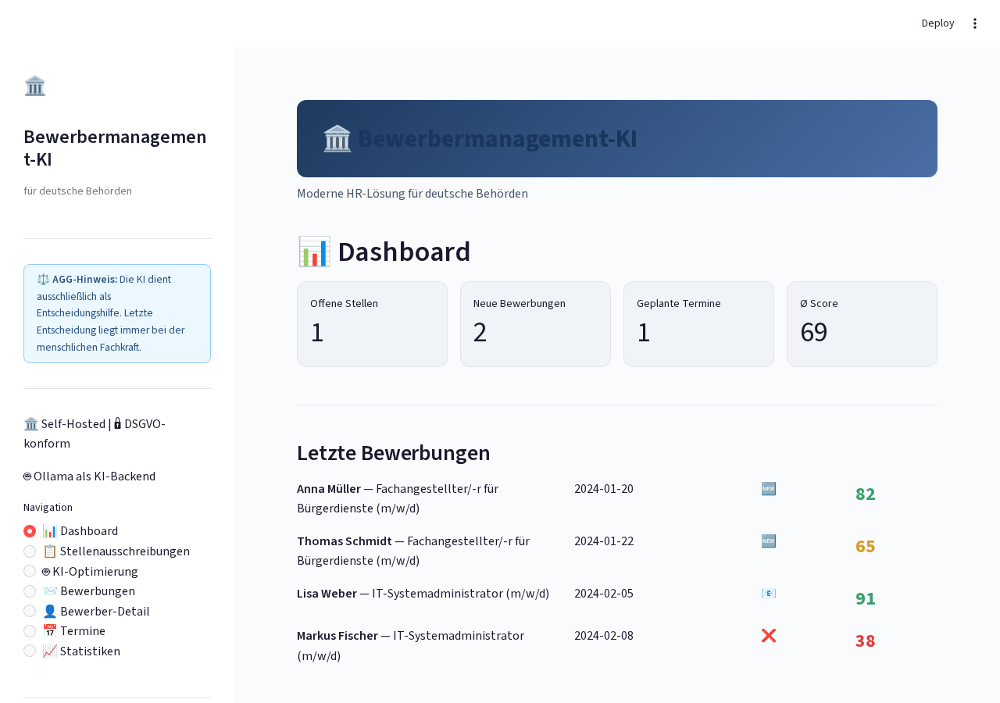
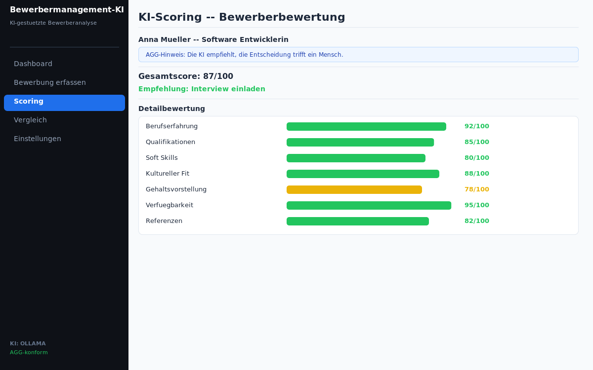
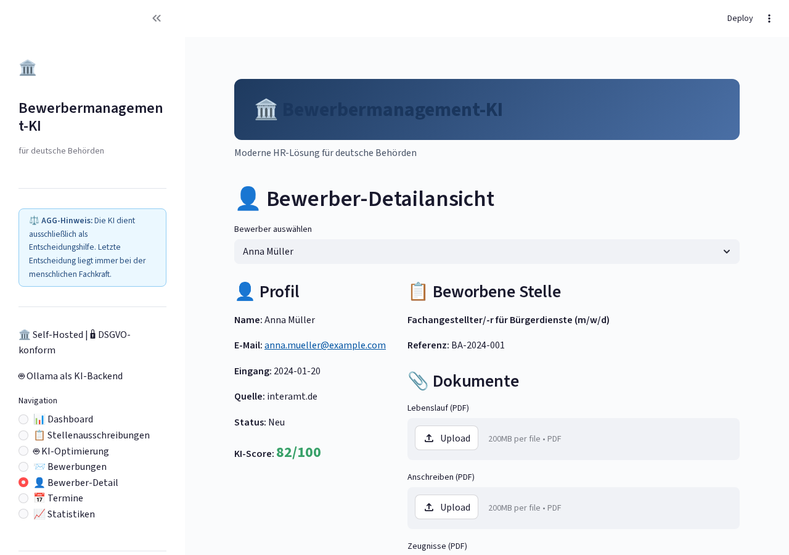

# Bewerbermanagement Ki

<p align="center">
</p>

    

> KI-gestütztes Bewerbermanagement mit transparentem Scoring (AGG-konform)

## Overview

Transparentes Bewerbermanagement-System mit KI-Unterstützung. Automatisches Scoring mit erklärbarer KI, AGG-konform und DSGVO-sicher. Self-hosted mit Ollama.

## Features

- Transparentes KI-Scoring mit Erklärung
- AGG-konforme Bewertung
- Automatische Eignungsanalyse
- Vergleichs-Dashboard
- E-Mail-Benachrichtigungen
- DSGVO-konforme Datenspeicherung

## Tech Stack

| Tech | Zweck |
|------|-------|
| Python 3.11+ | Backend |
| Streamlit | Web-Interface |
| Ollama | Lokale KI |
| PostgreSQL | Datenbank |
| Docker | Deployment |

## Quick Start

```bash
pip install -r requirements.txt
streamlit run app.py
```

## Screenshots

**Dashboard mit Bewerberübersicht**



**KI-Scoring mit transparenter Erklärung**



**Bewerbervergleich**



---

## Contributing

Beiträge sind willkommen! Bitte erstelle einen Issue oder Pull Request.

## License

MIT License — siehe [LICENSE](LICENSE).

<p align="center">
</p>